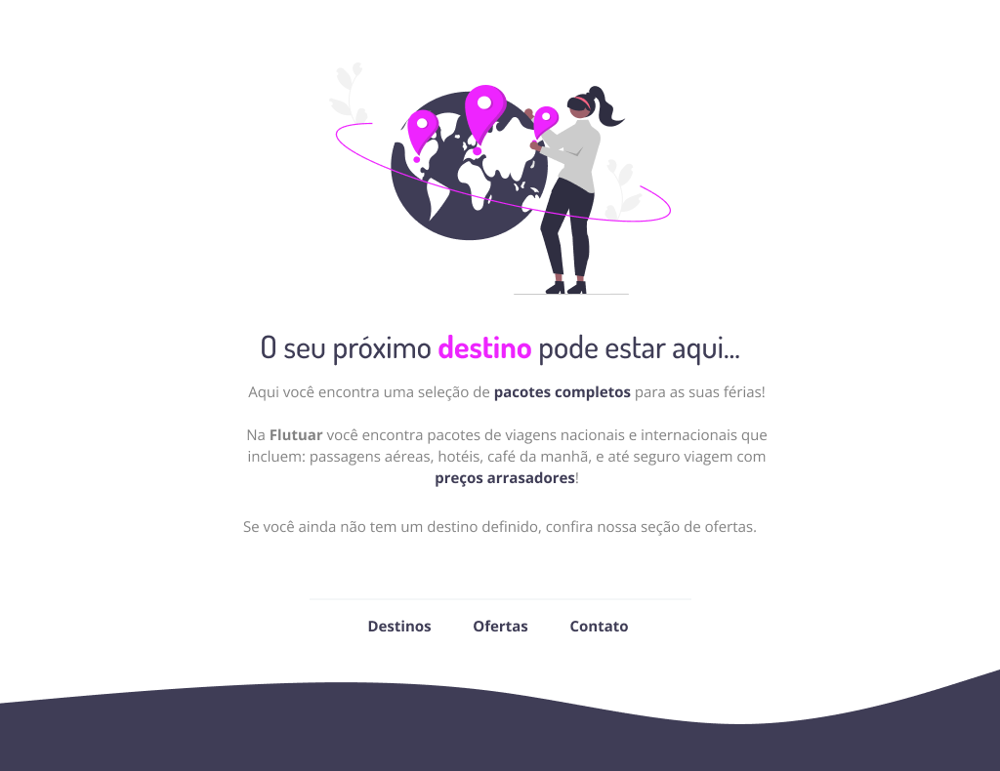

<h1 align=center><strong>Flutuar✈️</strong></h1>

Projeto feito como aprendizado pela Rocketseat, com o tema de viajem! 

 

 

## <strong>TECNOLOGIAS 🧠</strong>

- HTML
- CSS
- FIGMA

## <strong>PROJETO 📲</strong>

Este projeto tem o intuito de servir como uma prática, um exercicío para praticar HTML, CSS e FIGMA.
